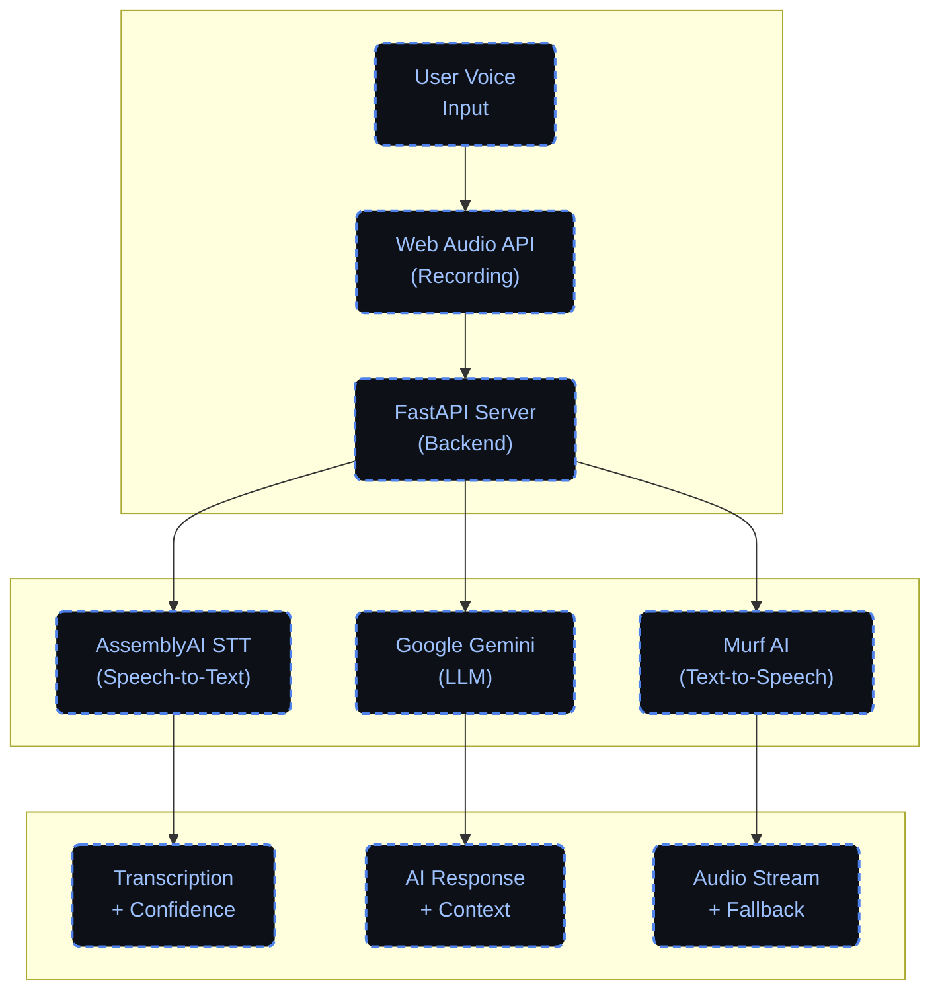

# N9NE — AI Voice Agent

<div align="center">


A production-ready AI voice agent that creates natural conversations through voice.

[](https://murf.ai/)
[](https://fastapi.tiangolo.com)
[](https://www.python.org)
[](https://tailwindcss.com)
[](https://www.assemblyai.com/)
[](https://deepmind.google/technologies/gemini/)

</div>

## Overview

N9NE is an intelligent voice interaction platform that:
- Records your voice through the browser
- Transcribes speech using AssemblyAI
- Processes requests with Google's Gemini LLM
- Responds via Murf AI text-to-speech
- Maintains persistent conversation history

## Live Demo

🚀 **Try N9NE AI Voice Agent Now!**

- **Local Demo**: Run the application locally and visit `http://localhost:8000`
- **Voice Agent Interface**: Access the full voice interaction at `http://localhost:8000/static/explore.html`
- **Real-time Conversation**: Experience natural voice conversations with AI

> 💡 **Note**: Make sure to configure your API keys in the `.env` file for full functionality.

## Tech Stack

### Backend
- **Framework**: FastAPI with Uvicorn
- **Data Validation**: Pydantic
- **Environment**: Python 3.9+

### AI Services
- **Speech-to-Text**: AssemblyAI
- **Language Model**: Google Gemini
- **Text-to-Speech**: Murf AI

### Frontend
- **UI**: HTML with TailwindCSS
- **Interactivity**: Vanilla JavaScript
- **Audio**: MediaRecorder API
- **Networking**: Fetch API

### Storage
- **Chat History**: JSON file persistence

N9NE is a production-ready AI voice agent that records your voice, transcribes with AssemblyAI, reasons with Gemini, replies via Murf AI TTS, and keeps persistent chat history. A clean frontend powered by Tailwind + vanilla JS drives the experience.

---

### What’s inside

- **Backend**: FastAPI, Uvicorn, Pydantic
- **AI services**: AssemblyAI (STT), Google Gemini (LLM), Murf AI (TTS)
- **Frontend**: HTML, TailwindCSS CDN, Vanilla JS (`MediaRecorder`, `fetch`)
- **Persistence**: JSON file (`chat_history.json`)

---

## Architecture



### Processing Flow

1. **Input Layer**
   - User Voice Input: Raw audio capture
   - Web Audio API: Audio recording and processing
   - FastAPI Server: Backend request handling

2. **Processing Layer**
   - AssemblyAI: Speech-to-Text conversion
   - Google Gemini: Language model processing
   - Murf AI: Text-to-Speech synthesis

3. **Output Layer**
   - Transcription with confidence scoring
   - AI responses with context management
   - Audio streaming with fallback options

### Data Flow Description

1. **User Input Stage**
   - User speaks into microphone
   - Browser captures audio via MediaRecorder
   - Audio is encoded as webm format

2. **Backend Processing**
   - FastAPI receives audio upload
   - Associates with session ID
   - Updates chat history
   - Queues for AI processing

3. **AI Processing Pipeline**
   - AssemblyAI converts speech to text
   - Gemini LLM generates response
   - Murf AI converts response to speech

4. **Response Delivery**
   - MP3 audio streamed back to client
   - Browser plays audio response
   - Chat history updated
   - Ready for next interaction

## Key Features

1. **Complete Voice Pipeline**
   - Voice input → Text transcription → AI processing → Voice response

2. **Persistent Sessions**
   - Unique session IDs for each conversation
   - Chat history stored in JSON format
   - Easy retrieval and management of conversations

3. **Smart Interaction**
   - Automatic recording after AI response
   - Fast turn-taking for natural conversation flow
   - Real-time status updates and transcripts

4. **Robust Error Handling**
   - Graceful fallback audio responses
   - Comprehensive error messages
   - API key validation and status checks

5. **Modern Interface**
   - Clean, responsive design with Tailwind CSS
   - Real-time status indicators
   - Chat transcript display

---

## Quick Start Guide

### Prerequisites
- Python 3.9 or higher
- Git
- API keys for AssemblyAI, Murf AI, and Google Gemini

### Installation Steps

1. **Clone the Repository**
   ```bash
   git clone https://github.com/aryansondharva/Erynx.git
   cd Erynx
   ```

2. **Set Up Virtual Environment**
   ```bash
   # Create virtual environment
   python -m venv venv

   # Activate virtual environment
   # For Windows:
   venv\Scripts\activate
   # For macOS/Linux:
   # source venv/bin/activate
   ```

3. **Install Dependencies**
   ```bash
   pip install -r requirements.txt
   ```

4. **Configure Environment**
   Create a `.env` file in the root directory:
   ```ini
   # API Keys
   MURF_API_KEY=your_murf_api_key
   ASSEMBLYAI_API_KEY=your_assemblyai_api_key
   GEMINI_API_KEY=your_gemini_api_key
   ```

5. **Launch the Server**
   ```bash
   # Option 1: Using Python directly
   python main.py

   # Option 2: Using Uvicorn
   python -m uvicorn main:app --host 127.0.0.1 --port 8000
   ```

6. **Access the Application**
   - Main Landing Page: [http://127.0.0.1:8000/](http://127.0.0.1:8000/)
   - Voice Agent Interface: [http://127.0.0.1:8000/static/explore.html](http://127.0.0.1:8000/static/explore.html)

> 💡 **Note**: If you modify the port or host, update `BASE_URL` in `static/explore.html`

## Environment Variables

| Variable | Description | Required |
|----------|-------------|----------|
| `MURF_API_KEY` | API key for Murf AI text-to-speech service | Yes |
| `ASSEMBLYAI_API_KEY` | API key for AssemblyAI speech recognition | Yes |
| `GEMINI_API_KEY` | API key for Google's Gemini language model | Yes |
- If any key is missing, endpoints using that service will serve a **fallback audio** response and still update chat history with a friendly message.
- Keys are loaded via `python-dotenv` on startup.

---

## API Endpoints

### Core Endpoints

| Method | Endpoint | Description |
|--------|----------|-------------|
| `GET` | `/` | Serves the landing page (`static/index.html`) |
| `POST` | `/agent/chat/{session_id}` | Main pipeline with chat history |
| `GET` | `/agent/chat/{session_id}/history` | Get chat messages |
| `DELETE` | `/agent/chat/{session_id}` | Delete a session |

### Audio Processing

| Method | Endpoint | Description |
|--------|----------|-------------|
| `POST` | `/upload` | Save uploaded audio |
| `POST` | `/transcribe/file` | Transcribe with AssemblyAI |
| `POST` | `/generate` | Text to speech with Murf AI |
| `POST` | `/voice-reply` | Full transcribe → TTS pipeline |

### Utilities

| Method | Endpoint | Description |
|--------|----------|-------------|
| `POST` | `/murf-tts` | Direct TTS conversion |
| `POST` | `/murf-tts-json` | TTS with JSON response |
| `GET` | `/fallback/audio` | Backup audio response |
| `GET` | `/agent/chat/test` | System health check |

> 💡 **Note**: All audio responses stream as `audio/mpeg` when successful

## Frontend Architecture

### Pages
- **Landing Page** (`static/index.html`)
  - Clean, modern interface
  - Quick access to voice agent
  - Project information

- **Voice Agent UI** (`static/explore.html`)
  - Real-time voice recording
  - Live transcription display
  - Chat history visualization
  - Automatic audio playback

### Features
- Browser-based audio recording via `MediaRecorder`
- Seamless integration with backend API
- Auto-restart recording after responses
- Real-time status updates
- Persistent session management

### Configuration
- Base URL: `http://127.0.0.1:8000` (default)
- Configurable in `static/explore.html`
- CORS support for cross-origin deployment

---

### Frontend integration details

- **BASE_URL**: defaults to `http://127.0.0.1:8000` in `static/explore.html`.
- **Recording format**: Browser records `audio/webm`; backend accepts it directly.
- **Endpoints used by UI**:
  - `POST /agent/chat/{session_id}` (audio → STT → LLM → TTS)
  - `GET /agent/chat/{session_id}/history` (render chat history)
  - `POST /transcribe/file` (quick transcript preview)
  - `GET /fallback/audio` (graceful error audio)
- **Session handling**: `session_id` persisted in URL query; history saved to `chat_history.json`.
- **Auto-recording**: Recording auto-restarts after TTS playback finishes (with event + timeout backup).
- **Voice options**: `default`, `narrator`, `support`, `sergeant`, `game` (mapped to Murf voices in `main.py`).

---

## Project Structure

```
N9NE/
├── main.py                 # FastAPI application & endpoints
├── manage_chat.py         # Interactive chat history manager
├── simple_chat_manager.py # CLI helper (non-interactive)
├── requirements.txt       # Python dependencies
├── chat_history.json     # Persistent conversation storage
├── vercel.json           # Deployment configuration
├── static/               # Frontend assets
│   ├── index.html       # Landing page
│   ├── explore.html     # Voice agent interface
│   ├── script.js        # Frontend logic
│   └── audio/          # Generated audio files
└── uploads/             # Temporary audio storage
```

## Deployment Guide

### Vercel Deployment

The project includes `vercel.json` for serverless deployment. Two options are available:

1. **Recommended Structure**
   ```bash
   # Move main.py to api directory
   mkdir api
   mv main.py api/
   ```

2. **Alternative Configuration**
   ```json
   {
     "routes": [
       { "src": "/(.*)", "dest": "main.py" }
     ]
   }
   ```

> ⚠️ **Important**: Configure environment variables in your Vercel project settings

## Troubleshooting Guide

### Audio Issues
- **No Response Audio**
  - Verify Murf AI API key
  - Check network connectivity
  - Look for fallback audio activation

### Transcription Problems
- **Failed Transcription**
  - Validate AssemblyAI API key
  - Review server logs
  - Check audio file format

### Connection Issues
- **CORS Errors**
  - Keep frontend and API on same origin
  - Configure CORS settings properly
  - Check request headers

### Permission Problems
- **Microphone Access**
  - Grant browser permissions
  - Check SSL if deployed
  - Verify browser compatibility

### Data Persistence
- **Chat History Issues**
  - Ensure write permissions
  - Verify JSON file integrity
  - Check storage space

## Screenshots

<details>
<summary>View Screenshots</summary>

> Add your screenshots in the `docs/` folder and reference them here:
> - UI Interface
> - Chat History View
> - API Testing Results

</details>

## Credits & Acknowledgments

N9NE was built as part of the **30 Days of AI Voice Agents** challenge.

### Services Used
- [AssemblyAI](https://www.assemblyai.com/) - Speech Recognition
- [Google Gemini](https://deepmind.google/technologies/gemini/) - Language Model
- [Murf AI](https://murf.ai/) - Text-to-Speech

### License
This project is licensed under the MIT License - see the [LICENSE](LICENSE) file for details.

---

<div align="center">
Made with ❤️ by <a href="https://github.com/aryansondharva">Aryan Sondharva</a>
</div>

---

### Deployment notes (Vercel, optional)

The included `vercel.json` is a starter. It routes to `api/main.py`, but this project’s app entry is `main.py` at the repo root. Use one of the following:

1) Move `main.py` to `api/main.py`, or
2) Update `vercel.json` to point to `main.py` and set the correct runtime.

Example route update:

```json
{
  "routes": [
    { "src": "/(.*)", "dest": "main.py" }
  ]
}
```

Make sure your environment variables are configured in your hosting provider.

---

### Troubleshooting

- **No audio in response**: Check Murf API key and network; fallback audio will be served on errors.
- **Transcription fails**: Ensure `ASSEMBLYAI_API_KEY` is valid. Check server logs.
- **CORS or mixed content**: Keep frontend and API on same origin during local dev or configure CORS properly.
- **Mic access denied**: Allow microphone permissions in your browser.
- **History not saving**: Verify the app can write `chat_history.json` in the project root.

---

### Screenshots (optional)

- Add screenshots to a `docs/` folder and reference them here, e.g. UI state, chat history view, or endpoint tests.

---

### Share it

- Take a screenshot of this README in your editor/preview and post to LinkedIn with your notes for Day 13.

---

### Credits

Built for the 30 Days of AI Voice Agents challenge. Services: AssemblyAI, Google Gemini, Murf AI.

